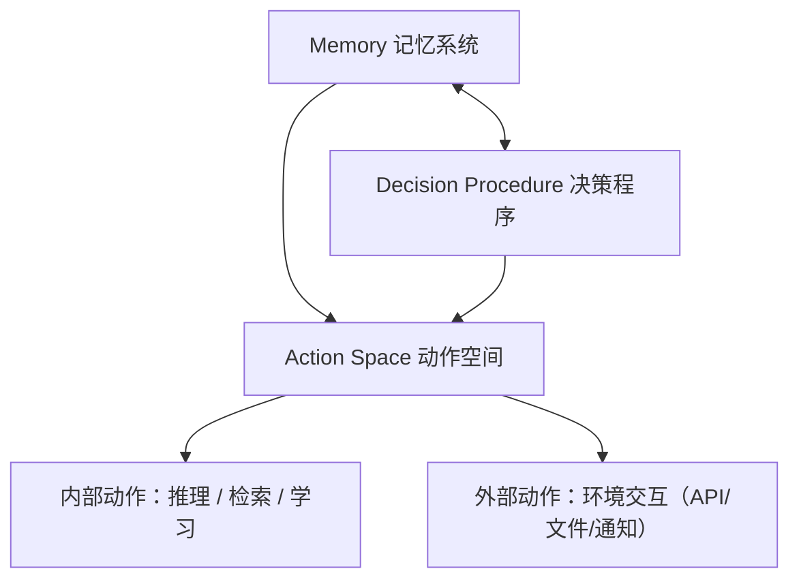
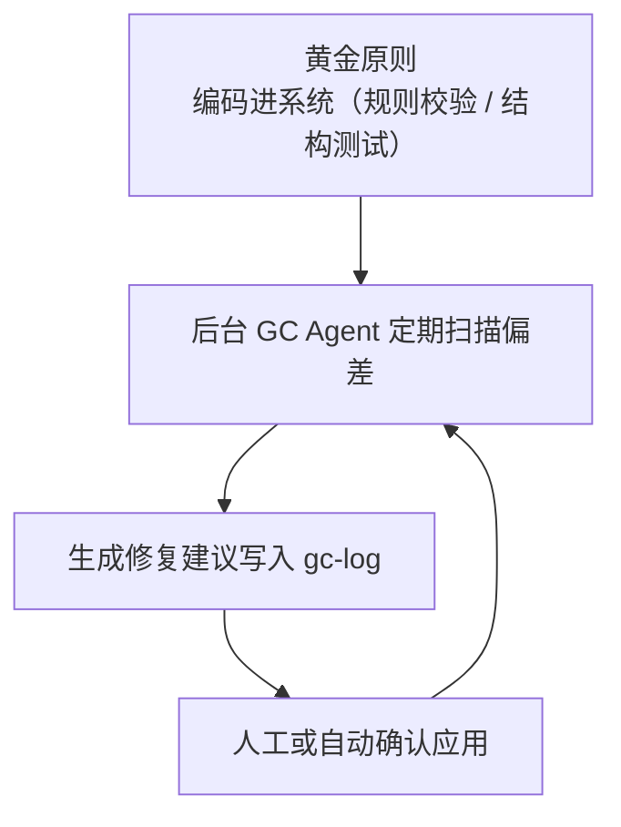
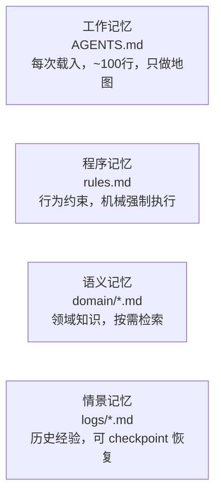
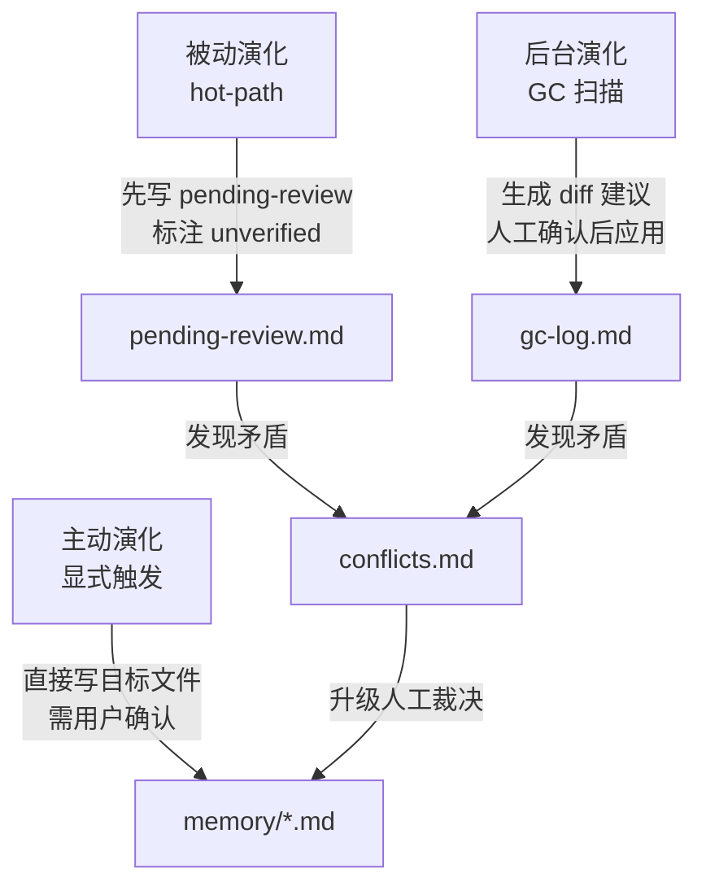

# AI Harness 调研笔记

> 核心问题：怎么让 Agent 可以长期执行任务并且保持一致？

Agent 的认知结构可以拆成三个维度：记忆、动作、决策。Harness 的工程职责是为这三个维度提供基础设施，并管理它们之间的信息流动。

---

## 框架总览：Agent 的认知结构

一个能长期工作的 Agent，内部结构可以这样理解：



**工作记忆是中心枢纽**，连接 LLM、长期记忆和环境接口。

Harness 的工程职责：**为这三个维度提供基础设施，并管理它们之间的信息流动。**

---

## 一、Memory（记忆系统）

Agent 的记忆分四类，Harness 对每类都有对应的工程实现。

### 1.1 工作记忆（Working Memory）= Context Window

Agent 当前决策周期里活跃的信息，存在 context window 里。

**Harness 的核心挑战**：context 是稀缺资源，必须主动管理。

| 问题         | Harness 的解法                                         |
| ---------- | --------------------------------------------------- |
| Context 膨胀 | 上下文压缩：把过去 50 轮压缩成摘要；读大文件时只给相关片段                     |
| Agent 跑偏   | 规划工具（todo list）作为"锚点"，即使是空操作也能让 Agent 保持任务焦点        |
| 指令太多       | AGENTS.md 只做目录（~100 行），指向深层文件；过多指导让 Agent 退化成本地模式匹配 |

**OpenAI 实践验证**：
> "一个巨大的 AGENTS.md 是失败的尝试——情境是稀缺资源，当一切都'重要'时，一切都不重要了。"

正确做法是**渐进式披露**：Agent 从小而稳定的入口开始，被引导去下一步查看什么，而不是一开始就被淹没。

### 1.2 情景记忆（Episodic Memory）= 历史经验

存储早期决策周期的经验、历史事件流。

**Harness 实现方式**：
- Session 机制（SQLite / Redis / 加密 Session）：自动在每次运行前取回对话历史，运行后存入新消息
- Checkpoint：Agent 崩溃后从最近检查点恢复，而不是从头开始
- 子 Agent 隔离：主 Agent 调用子 Agent 时，Harness 创建干净的内存作用域，防止试错过程污染主上下文

**OpenAI SDK 的四种跨会话状态策略**：

| 策略 | 存储位置 | 适用场景 |
|---|---|---|
| `result.to_input_list()` | 应用内存 | 手动精确控制 |
| `session`（SQLite/Redis 等） | 自己的存储 | 持久化、可恢复的对话 |
| `conversation_id` | OpenAI 服务端 | 命名共享对话 |
| `previous_response_id` | OpenAI 服务端 | 轻量级续接 |

### 1.3 语义记忆（Semantic Memory）= 知识库

Agent 对世界和自身的知识，从外部知识库初始化。

**Harness 的关键工程原则**：知识库即记录系统（Knowledge Base as System of Record）

**核心约束**：
> "Agent 在运行时无法访问的东西就不存在。用户的历史对话、业务规则、领域知识——如果不以结构化形式存入知识库，对 Agent 不可见。"

因此，所有知识必须以版本化的形式存在于 Agent 的知识库中：

```
AGENTS.md              ← 地图（~100行），指向下层
memory/
├── procedural/        ← 行为规则和用户偏好
├── semantic/
│   ├── index.md       ← 知识地图
│   └── domain/        ← 各业务领域知识
└── episodic/          ← 历史会话和 checkpoint
```

**质量保障**：结构校验 + 定期运行 GC Agent 扫描过时内容，自动提交修复建议。

**LangChain Agent Builder 的落地方式**：
- 程序性记忆 → `AGENTS.md` + `tools.json`
- 语义记忆 → agent skills、知识文件
- 底层存储：虚拟文件系统（Postgres 存储，对 Agent 呈现为文件系统）

### 1.4 程序记忆（Procedural Memory）= 行为规则

- **隐式**：存在 LLM 权重里（不可直接修改）
- **显式**：Agent 代码、规则、约束——这是 Harness 能直接控制的部分

对服务端 Agent Builder 而言，程序记忆的显式部分体现为三层规则：

| 层级      | 内容                                 | 可变性     |
| ------- | ---------------------------------- | ------- |
| **系统级** | 平台强制的安全边界、响应格式、工具调用权限              | 不可被用户覆盖 |
| **租户级** | 服务商为特定 Agent 定义的业务约束（如"只回答产品相关问题"） | 租户可配置   |
| **用户级** | 从交互中积累的个人偏好（语气、详细程度、领域术语）          | 可随交互演化  |
|         |                                    |         |

**核心逻辑**：越靠近系统层的规则越不可变，越靠近用户层的规则越可演化。

> 关键洞察：规则一旦编码进系统，就会立即、一致地应用于所有交互——这是 Agent 和人工客服最大的差异，也是约束作为倍增器的根本原因。

**安全写入**：LangChain Agent Builder 默认需要人工审核才能修改程序记忆（防 prompt injection 污染规则），提供 "yolo mode" 让用户自己决定。

---

## 二、Action Space（动作空间）

Agent 的动作分为内部和外部两类。

### 2.1 内部动作

| 类型                | 定义      | Harness 实现                           |
| ----------------- | ------- | ------------------------------------ |
| **推理（Reasoning）** | 更新工作记忆  | Reflect 步骤、Plan-and-Execute 的规划阶段    |
| **检索（Retrieval）** | 从长期记忆读取 | 向量检索、知识库查询、session 历史读取              |
| **学习（Learning）**  | 写入长期记忆  | Hot-path 实时写入、GC Agent 修复建议、用户显式确认写入 |

### 2.2 外部动作：标准工具集（The Body）

Harness 为 Agent 提供标准化的"躯体"。对服务端 Agent Builder 而言：

| 工具            | 说明                            | 安全边界        |
| ------------- | ----------------------------- | ----------- |
| **知识检索**      | 向量搜索、结构化查询，从语义记忆拉取相关内容        | 租户隔离，不跨用户读取 |
| **外部 API 调用** | 调用第三方服务（CRM、日历、通知、数据库）        | 权限白名单，沙箱化凭据 |
| **会话管理**      | 读写 session 状态，管理多轮对话上下文       | 用户级隔离       |
| **规划接口**      | `update_task_status`，把执行进度持久化 | —           |
| **通知接口**      | 向用户或外部系统推送结果（邮件、Webhook、消息）   | 限速，防滥用      |

**两种 Context 的区分**（对服务端 Agent 尤其重要）：
- **Local Context**：只在服务层可见，不发给 LLM——租户 ID、用户鉴权 token、数据库连接
- **LLM Context**：LLM 能看到的——对话历史、instructions、工具返回值、用户消息

Local Context 的隔离是多租户安全的基础：**租户身份信息绝不能进入 LLM 的 context window。**

---

## 三、Decision Procedure（决策程序）

Agent 的决策循环是：**规划（提案→评估→选择）→ 执行**

Harness 对应的三种执行模式，复杂度递增：

### ReAct（浅层 Agent）
```
决策 → 执行单个工具 → 获取观察 → 继续迭代
```
问题：任务复杂后 Prompt 膨胀，LLM 处理难度上升。

### Plan-and-Execute
```
规划 LLM（生成完整计划） → 执行 LLM（逐步执行每个步骤）
```
关注点分离，适合生产环境可靠性要求高的场景。代价是 API 调用增多。

### Deep Agents（深度 Agent）

在 Plan-and-Execute 上增加四个特性：
1. **详细系统提示**：具体指导 + few-shot 示例
2. **规划工具**：todo list 作为锚点，空操作本身就能维持任务焦点
3. **子 Agent**：任务拆分 + 上下文隔离
4. **文件系统**：多 Agent 共享状态的媒介

---

## 四、熵控制：让系统长期稳定

长期运行的 Agent 系统面临一个必然问题：**Agent 会复现它接触过的模式，包括坏的模式，漂移不可避免。**

对 Agent Builder 服务而言，熵增的来源更多样：
- 用户反馈写入了互相矛盾的偏好
- 知识库内容随时间过时但没有更新
- Agent 的实际行为和程序记忆里的规则逐渐偏离

**解法：把垃圾回收自动化**



> 类比垃圾回收：持续以小额方式清理知识库，比让矛盾和过时内容积累后集中处理要好得多。

**后台 GC 扫描的四个目标**：
- 不同文件之间的矛盾（A.md 说"偏好 X"，B.md 说"避免 X"）
- 过时内容（记录的决策已经被后来的行为推翻）
- 知识空白（某个领域有引用但没有实质内容）
- 漂移的模式（实际行为和规则文件描述不一致）

**吞吐量改变了审核哲学**：在高并发的服务端场景里，GC 建议中无语义冲突的修复可以自动应用；只有涉及用户偏好冲突或规则变更的，才升级到人工裁决。

---

## 五、自演化专用 Agent 的模板思路

### 核心思想：Everything is a File

四类记忆全部以文件形式存在。Agent 的所有状态都是可读、可写、可版本化的文件——这是让 Agent 能够自演化的基础条件。



**Agent 在运行时无法访问的东西就不存在。** 所有知识必须落地为文件，才能被 Agent 利用和演化。

### 文件结构

目录组织的核心原则是**渐进式披露**——Agent 从入口开始，按需深入，不是一次性全部载入。

```
agent-root/
├── AGENTS.md                      ← 唯一总入口，~100行，只做目录和地图
│
├── memory/
│   ├── working/
│   │   └── current-task.md        ← 当前任务状态，每次覆盖
│   ├── procedural/
│   │   ├── rules.md               ← 强制约束，linter 验证
│   │   └── preferences.md         ← 偏好，可演化
│   ├── semantic/
│   │   ├── index.md               ← 知识地图，指向子文件
│   │   └── domain/
│   │       └── *.md               ← 各领域知识
│   └── episodic/
│       ├── sessions/
│       │   └── YYYY-MM-DD.md      ← 每次会话记录
│       └── checkpoints/
│           └── latest.json        ← 最近状态快照
│
└── evolution/
    ├── pending-review.md          ← 待人工审核的写入
    ├── gc-log.md                  ← 后台 GC 扫描日志
    └── conflicts.md               ← 发现的矛盾，待解决
```

**每类文件的格式约定**：

| 文件                        | 格式            | 特殊要求                  |
| ------------------------- | ------------- | --------------------- |
| `AGENTS.md`               | Markdown，纯目录  | 不超过 100 行，每条指向具体文件    |
| `rules.md`                | 编号列表，每条可机械验证  | 有对应 linter 规则         |
| `preferences.md`          | KV 风格，带置信度和来源 | 标注是 hot-path 写入还是用户确认 |
| `domain/*.md`             | 自由结构，带最后更新时间  | 必须有交叉链接               |
| `sessions/*.md`           | 时间线流水账        | 不整理，原始记录              |
| `checkpoints/latest.json` | 结构化 JSON      | 包含任务状态、上下文摘要          |

### 三种演化机制的分工

三种演化可以并存，各有职责：



| 机制 | 触发条件 | 写入目标 | 置信度标注 | 冲突处理 |
|---|---|---|---|---|
| **被动（hot-path）** | 用户纠正、任务完成、发现新信息 | `pending-review.md` | `[hot-path, unverified]` | 写入 `conflicts.md`，不覆盖 |
| **主动（显式）** | 用户说"记住"/"以后不要这样" | 目标文件，需确认 | `[user-confirmed]` | 覆盖旧值，旧值存档到 episodic |
| **后台（GC）** | 定时或手动触发 | `gc-log.md`，diff 形式 | — | 矛盾升级给用户裁决，不自动解决 |

前两种是"分配内存"，后台演化是"垃圾回收"。没有 GC，文件系统最终会变成一堆互相矛盾的碎片。

### 同一套模板，三种用途

三种用途的本质差别只是**文件内容不同**，Harness 架构完全一样。

| 用途       | 核心文件                                                           | 演化信号来源                   |
| -------- | -------------------------------------------------------------- | ------------------------ |
| **个人助理** | `user-profile.md`、`rhythm.md`、`preferences.md`                 | 用户的纠正和反馈                 |
| **工程场景** | `domain/architecture.md`、`domain/patterns.md`、`preferences.md` | CI 失败、code review、linter |
| **知识管理** | `domain/*.md`、`connections.md`、`unknowns.md`                   | 阅读、探索、主动推断               |

创建不同的文件集合，同一个 Agent 模板就自然变成三种完全不同形态的专用 Agent。

---

## 六、系统层级

```
Work Manager                          管理工作分发与质量门控
    ↑ 构建于
Agent Harness   (Deep Agent)          封装能力与环境
    ↑ 构建于
Agent Framework（LangChain、LangGraph）定义逻辑与流程
    ↑ 构建于
Agent Runtime（Vercel AI SDK 等）      执行与服务
```

**Work Manager 在 Agent Builder 场景下的形态**：
- 接收用户请求，拆解为任务卡片分发给对应 Agent
- 监控执行质量，路由低质量结果到 Annotation Queue
- GC Agent 的修复建议在这一层完成审核和应用
- 核心转变：从"监督单个 Agent"到"管理跨 Agent 的工作流质量"

---

## 七、多 Agent 组织模式

| 模式 | 结构 | 适合场景 |
|---|---|---|
| **层级型** | 主 Agent 生成子 Agent，共享文件系统协作 | 深度工作、长周期任务 |
| **监督-研究员型** | 监督 Agent 并行分发，结果汇总 | 并行信息收集 |
| **单 Agent 编排型** | 一个 Agent 顺序处理各阶段，配置驱动 | 简单、可控、易评估 |

子 Agent 的切分核心是**上下文隔离**，而不只是并行性：主 Agent 调用子 Agent 时，Harness 为子 Agent 创建干净的内存作用域，防止试错过程污染主上下文。

## 参考材料

| 来源                                                                                                      | 类型   | 核心贡献                            |
| ------------------------------------------------------------------------------------------------------- | ---- | ------------------------------- |
| [Cognitive Architectures for Language Agents](https://arxiv.org/abs/2309.02427)                         | 学术论文 | 四类记忆 + 动作空间 + 决策程序的统一认知框架       |
| [OpenAI Harness Engineering](https://openai.com/index/harness-engineering/)                             | 工程实践 | 100 万行代码、0 行人工编写的完整经验总结         |
| [LangChain Agent Builder Memory](https://blog.langchain.com/how-we-built-agent-builders-memory-system/) | 工程实践 | 四类记忆的落地实现，虚拟文件系统 + AGENTS.md    |
| [Deep Agents](https://github.com/langchain-ai/deepagents)                                               | 开源项目 | batteries-included harness 参考实现 |
| [DeerFlow](https://github.com/bytedance/deer-flow)                                                      | 开源项目 | Super Harness，sub-agent 作为一等公民  |
| [open_deep_research](https://github.com/langchain-ai/open_deep_research)                                | 开源项目 | LangGraph 驱动，staged compression |
| [Symphony](https://github.com/openai/symphony)                                                          | 开源项目 | Work Manager，Linear 集成，事件驱动     |
